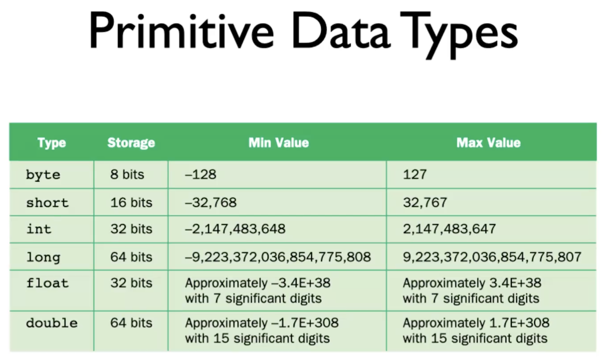
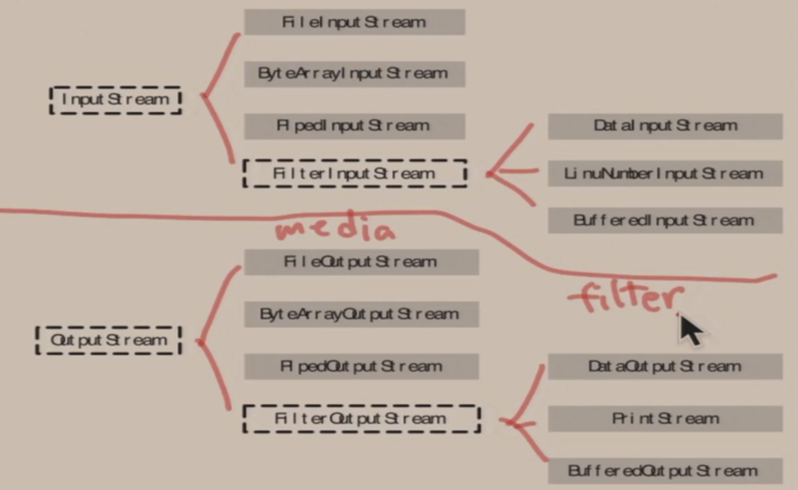
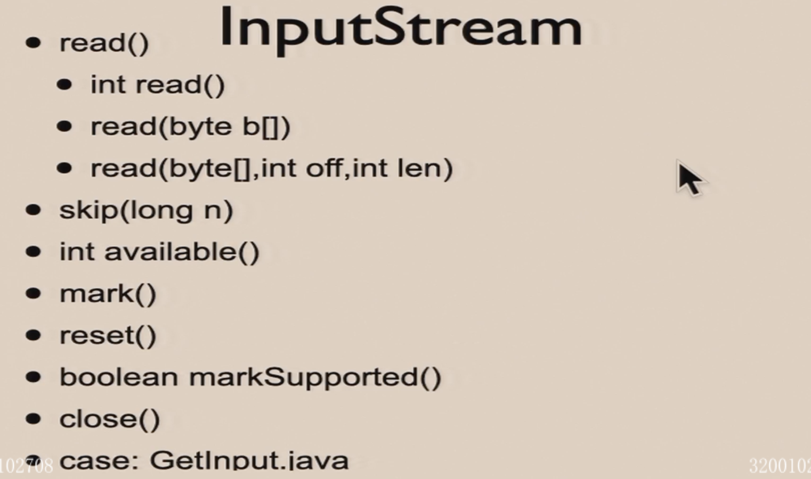
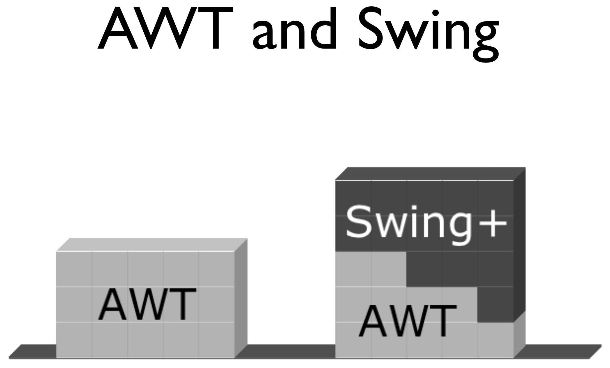
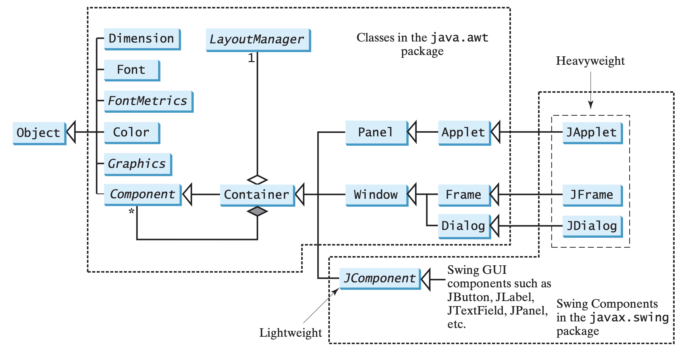
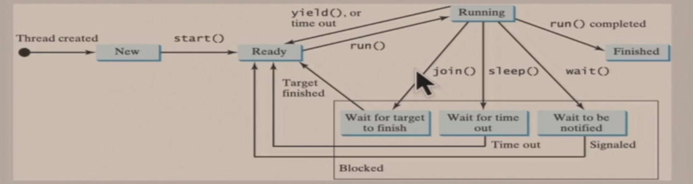
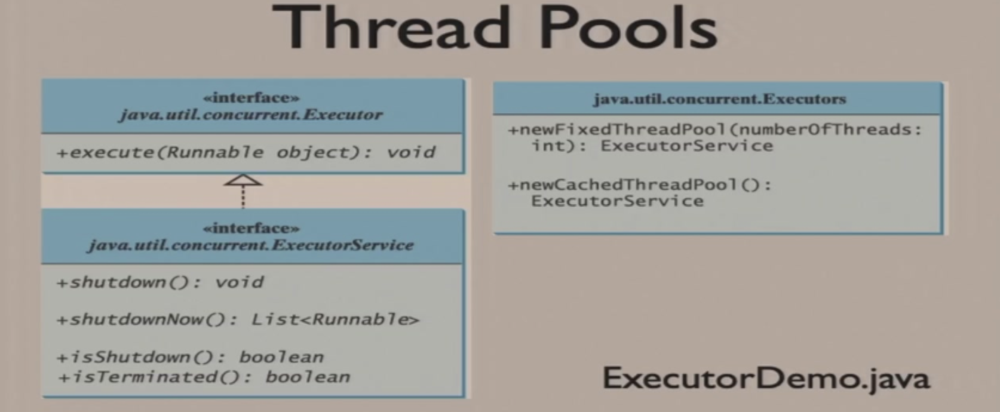
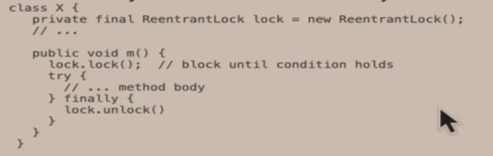
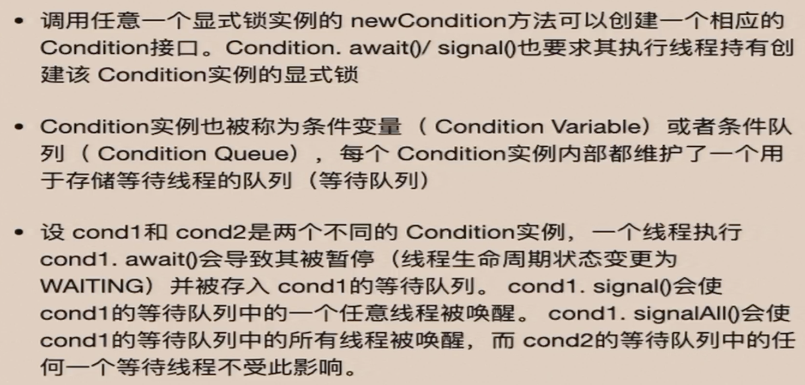
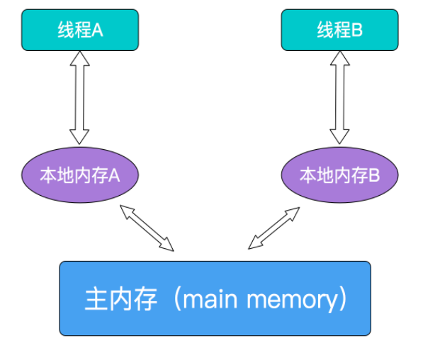

# Java入门 对比C++

## **Java = C++ --**

- 没有多继承与虚继承
- 没有模板

## 动态类型的实现方式

对静态编译型语言例如C家族，变量、函数、类等等都将被转为汇编意义下的函数，并最终硬连接为单个可执行文件。于是这个可执行文件编译后是完全静态的，类型检查等必须在编译、连接时完成。

但是对Java，编译后每一个类都是一个单独的.class文件，运行时由JVM负责调用。于是.class之间相互独立，类型检查动态的由JVM在调用时检查。

这为Java带来很多好的特性，比如可以在运行过程中替换当前没有使用的类等。

## 内存模型

C++完全继承了C对内存的灵活管理，对象可以被放在heap、stack、global三类位置。对象完全由程序员创建，这使得通用容器的实现比较麻烦。

Java所有的对象都继承自Object（称为单根结构）。**Java也只能通过new来创建新对象，而new得到的结果是指针。**指针的关闭需要手动而对象本体的回收是自动的。在下面的程序中能够看到两者的区别。

## 玩内存和String的程序

```java
import java.util.Scanner;

public class Num{
  int i;
}

public class Main {
    public static void main(String[] args) {
        Scanner in = new Scanner(System.in);
      	// 要读入，就要先创建读入的对象
        int n = in.nextInt();
        System.out.println("Hello world!");
        System.out.println(n);
        in.close();
      	// 重要
      	// 这里的in是一个 **指针**
      	// in.close()令这个指针不能再使用，这与垃圾回收有关
      	// 如果没有in.close()，这里可能会造成垃圾回收失效，后果类似内存泄漏
      	// 但是这里的close完全不同于C++中的delete
    }

    public static void playString() {
      	// 类似Python Java的字符串是不可变的（Immutable）
      	// 对字符串内容的修改实质上都是指针指向了一个新的对象而不是修改了原对象的内存数据
        String s1 = new String("Hello");
      	String s2 = new String("Hello");
        String s3 = "Hello"; // 这里是语法糖 其实就是new
        String s4 = "Hello";
        String s5 = "Hel" + "lo";
      	String s6 = "Hel";
        s6 += "lo";
      	// s1 != s2 != s3 因为new对象得到的是**指针** 多次new显然指针不相等
      	// s3 == s4 == s5 这是Java编译器的特殊优化 包括s5的加法是编译时计算的而不是运行时
      	// s5 != s6 			Java编译器的优化不跨行
      
      	Scanner in = new Scanner(System.in);
      	String inStr = in.next();
      	System.out.println(inStr == "Hello"); 
      	// 一定是false即使输入了Hello 因为inStr和"Hello"一定不是同一个指针
        System.out.println(inStr.equals("Hello"));
      	// 可以是true
      
        Num n1 = new Num();
        n1.i = 20;
        Num n2 = n1;
        n2.i = 50;
        System.out.println(n1.i);
        // 输出的结果是50 n2=n1是令指针相等 而没有对象的复制
      
        int age = 21;
        System.out.println(s1 + " " + s2 + ", " + age);
      	// Hello Hello, 21
        // Java自带尝试从非字符串的类生成对应字符串的函数toString()
      	// 可以通过字符串+其他类自动调用
      	// toString()是由Object定义的，所有的类都可以用
    }
  
  	public static void playObj(){}
}
```

# Java基础

## 基础数据类型



Java并没有像Python一样做到一切皆对象，Java的基础数据类型不继承Object。基础数据类型的变量与C家族的变量类似，作为参数传递时存在拷贝，而不是像来自Object的对象变量一样传递的其实是指针。

与CPP不同的是：

- Java的所有数据类型都是有符号的
- 因为Java原生使用Unicode，它的char为16bit
- Java各类型对应的bit数全平台统一

一个可以了解的语法糖是：

- 对包裹类型Integer、Short、Long、Byte，JVM预制[-128, 127]的对象

- ```java
  int i = 127;
  Integer i1 = i;
  Integer i2 = 1;
  // i1 == i2 为真，共同指向了预制的对象
  // 但是如果i = 128，i1便不等于i2了
  ```

## 垃圾回收

Java的垃圾回收不是单纯的依据引用计数，因为引用计数无法解决循环引用问题。

垃圾回收实质机制是：

- 对栈上所有指针进行扫描，将其指向的堆上的对象打上标记
- 如果上面那个对象还有对象成员，继续打上标记，并递归的执行这个动作
- 标记结束后，遍历整个堆，没有被打上标记的对象即已经无用，可以被删除

需要注意的是：

- 显然这个方法开销很大，垃圾扫描不能时刻进行；可以通过System.gc()手动执行垃圾扫描，JVM也会在程序空闲时或内存资源不足时自动扫描。
- 在垃圾回收器标记某个对象为垃圾后，会首先调用其finalize()函数进行资源清理（这个函数定义在Object中）。
  - 程序员可以重载finalize()以实现特定的清理工作
  - 对于堆区的对象，或者说继承自Object的对象，非常不建议程序员手动调用finalize，应该交给gc处理，即使这从语法上是允许的
  - 但是对于文件、socket等非堆区的资源，调用finalize是可行的
- 标记为垃圾、调用finalize()也不意味着内存真正得到了释放。后者依赖JVM自动进行的二次扫描，不由程序员控制。

## 对象初始化

对成员变量，无论有没有显式的初始化，JVM在分配内存时都会把它先设为0；局部变量没有初始值。

同时对基础数据类型，无论声明被写在哪里：

- 它都会在程序最开始的时候被分配空间并初始化为0，并且可以在声明出现之间被调用（主流语言中只有Java做到了，这需要至少两遍扫描）
- 但是初始化代码的运行是按顺序的

```java
public class Main(){
  int a = 10;
  int i = f();
  
  int f(){
    return a;
  }
}
// 当然可以执行，最终i == a == 10
```

```java
public class Main(){
  int i = f();
  int a = 10;
  
  int f(){
    return a;
  }
}
// 也可以执行，最终i == 0
// 这证明了基础数据类型会在程序最开始的时候被分配空间并初始化为0，但按照代码顺序初始化
```

```java
public class Main(){
  int i = a;
  int a = 10;
  // 这不能执行，源自java的语法检查，从内存角度其实可行
}
```

除此之外，Java的this特别的，可以用于构造函数：

- this( ) 不能在普通方法中使用，只能写在构造方法中

- **在构造方法中使用时，必须是第一条语句**

- ```Java
  public class Student {
      String name;
    
      public Student() {
          this("张三"); // 调用另外一个构造函数
      }
      public Student(String name) {
          this(name.length()); // 可以嵌套
      }
      public Student(int i){
          this.name = String.valueOf(i);
      }
  }
  ```

## Java的static

```java
class Bowl {
  // 静态代码块，其地位和执行时机等同于静态成员初始化，但你可以在其中放语句
  static{
    System.out.println("Bowl class!");
  }
}
```

静态成员初始化与静态代码块在**装载类文件**时执行，一定先于实例化。

## Package

### Compile Unit

Java的编译单元是单个Java文件。一个Java文件中至多有一个public类，并且public类必须与文件同名。

但是注意编译的结果是每个class一个.class文件，无论它是不是来自同一个.java文件。动态链接也是以.class为基本单位。

### import

Java的多文件管理方式很特别：

- C家族的管理方式是将声明提取到头文件，头文件再和源文件或者库相关联
- C++/C#还引入了命名空间以解决命名冲突
- Python import的原理是将文件其执行一次，在解释器中留下上下文痕迹
- 但是Java都不是
  - Java动态装载时会自动去合理的（比如package输出文件夹下）地方找有没有.class文件
  - 因此在同package中的类之间，往往不需要手动import就能直接互用
  - 但是不在同一个package时，或者不同地方有重名的.class时，JVM可能就没有办法找到需要的类了
  - **Java的import本质上只是一个路径**，告诉JVM动态连接找.class时可以去这里试试看
    - Java 工程管理相关的 ‘.’ 其实都应该按照 ‘/’ 来理解
    - 比如 import java.util.Vector 想表达的是去 java/util/ 找 Vector.class
    - 命令行 java package_name.class_name 想表达的是去运行 package_name/ 这个文件夹下的package_name家的class_name
- static import只导入包中static的部分

### Package

Java的包更像命名空间，表达项目文件的从属关系。

```java
package myJava.util;
public class Something{
   ...
}
```

那么它的路径应该是 **myJava/util/Something.java** 这样保存的。并且在编译.class时会被打上标记“这个Something类是myJava.util家的Something”。

如果你尝试将这个.class覆盖其他包下的同名.class，动态链接将会报错，因为.class中带有package相关的从属关系信息。跨package调用class也需要import指路。

### 访问权限

Java的默认访问权限是仅包内可见。Protected访问修饰符在Java中表示除自己外仅子类与**包内的类**可见。

因此Java有4种访问修饰符类型。

# Java的类

## 继承

### Super

super用来传递参数给父类的构造函数，并在此后作为访问父类的接口

```java
class p() {
  int var_in_p;
  p(int i){
    var_in_p = i;
  }
}

class s extends p {	// extends是Java继承的关键字，Java不允许多继承
  s(){
    super(5);		// 实际上调用了p(5); super的参数表必须和父类的定义匹配
								// super必须在构造函数的第一行，所以super()和this()只能二选一
    						// super函数必须存在，不存在编译器也会自动帮你加上一个没有参数的super();
    						// 这里没有手动调用super(int);会报错，因为p中没有无参数的构造函数
  }
  System.out.println(super.var_in_p);
  							// 所有对父类访问需要经过super
}
```

### Upcast

Java可以把子类的对象当成父类来用，区别是：

- CPP默认是静态绑定，动态绑定需要借助virtual。
- Java默认是动态绑定，除了：
  - final
    - final函数：这个函数不能被重写
    - final类：这个类不能被继承
  - private
    - 从外部根本访问不到所以也无所谓怎么绑定

Java动态绑定与静态绑定之间更多是语法现象，没有本质的性能差距。

对一个Java对象，可以使用其getClass方法，或者instanceof运算符来判断它的类型。这两种方法都不受向上整形的影响。getClass之间可以直接用==相比较，不受字符串指针那一套东西的影响。

### Override

Java没有类似C++的隐名机制，父子类同名、同参数、同返回值的函数都是重载关系，并且父类的重载中没有被override的仍然可以使用。

修饰符`@override`表示由编译器检查父函数中必须有被重载的同名函数，这样可以避免一些低级的错误，并不是只有存在这个修饰符才是重载。

```java
class Base {
    String str = "Base";
    public void func(){
        System.out.println(str);
    }
}

public class Student extends Base {
    String str = "Student";
  
    @Override
    public void func() {
        System.out.println(str);	// Java动态绑定，这里输出Student
        System.out.println(super.str); // 父类的变量没有丢失，可以通过super访问，输出Base
        super.func();	// 通过super直接调用父类对象，父类对象只知道父类成员，输出Base
    }

    public static void main(String[] args) {
        Student s = new Student();
        Base b = s;
        b.func(); // Java多态，用基类对象表达派生类成员时，调用方法会按照动态绑定规则优先找派生类
        System.out.println(b.getClass()); // 这里输出Student而不是Base，是Java多态的证据
    }
}
```

### Initialize

初始化顺序是：

1. **父类的**
   1. 类加载与静态变量/静态代码块初始化（只在第一次）
   2. 变量初始化
   3. 构造函数
2. **子类的**
   1. 类加载于静态变量/静态代码块初始化（只在第一次）
   2. 变量初始化
   3. 构造函数

```Java
class A {
  	// **特别注意**，构造父类时，对象自身仍然是子类的对象，适用于动态绑定
  	// 所以初始化父类对象的i时，出于动态绑定，调用的是B类的baz函数
    private int i = baz();

  	// 如果这里不定义baz() 父类不知道子类有baz函数 不能编译
  	// 但是这里加上baz 父类中i=baz()也会因为自动绑定去调用子类的成员函数 而不是调用父类自己的函数
  	// 这其实已经很有抽象类与接口的味道了
    public int baz() {
      	System.out.println(this.getClass());
        System.out.println("A");
        return 0;
    }
}

class B extends A {
  	// 需要显式的通过super才能调用父类的成员
  	// 但是如果在父类的baz中打印this.getClass() 会发现输出的还是B class
  	// 这说明super也只能显式的指定调用父类成员，并不改变Java对象具有的类型属性
    private int i = super.baz();

    public int baz() {
        System.out.println("B");
        return 10;
    }

    public static void main(String[] args) {
        A a = new B();
    }
}
```

### Abstract

```java
// 抽象类中允许你定义抽象的函数，抽象函数不需要函数体
// 抽象类不允许实例化
abstract class Instrument4 {
    public String what() {
        return "Instrument4";
    }

    public abstract void adjust();
}

// 非abstruct的子类必须实现父类中的所有抽象函数
// 下面这个例子编译不过 要么需要override adjust() 要么这个类继续标注为abstract 等待子类的实现
class Wind4 extends Instrument4 {
    public String what() {
      	// 虽然抽象类不能实例化，但是抽象类中的非抽象成员仍然可以通过super正常调用
        return super.what();
    }
}

```

### Interface

接口不同于类/抽象类继承的是：

- 接口可以多继承其他接口，extends跟多个即可；但是不能继承类
- 类可以实现多个接口，implements跟多个即可（但是inplement语法上应该被放在extends之后）

接口中的：

- 变量默认是public static final，实现了这个接口的成员都可以直接调用
- 函数默认是public abstract
- 可以在接口中定义static非抽象函数，通过 IntName.FuncName() 调用
- 还可以定义default非抽象函数，实现了这个接口的成员都可以直接调用（不用super）和override

接口是“纯虚”的类，变量也都是static final，于是通过implements接口来实现的“多继承”一定没有重复继承、环形继承等问题。

但是接口更有价值的应用在于，**可以用接口来表达函数的参数类型，而接口中一定只有函数的定义没有实现，于是使用接口可以实现不同代码部分之间高度解耦和隐藏实现。**只要实现了某个接口的对象就可以被传入，我们也只能使用这个接口相关的函数。传入的对象内部如何定义、如何实现、还实现了哪些接口均我们均无权访问。

```Java
interface Monster {
	void menace();
}

interface DangerousMonster extends Monster {
	void destroy();
}

class DragonZilla implements DangerousMonster {
	public void menace() {}
	public void destroy() {}
}


class HorrorShow {
	static void FuncForMonster(Monster b) { 
		b.menace(); 
	}
	static void FuncForDangerousMonster(DangerousMonster d) {
		d.menace();
		d.destroy();
	}
	public static void main(String[] args) {
		DragonZilla dz = new DragonZilla();
		FuncForMonster(dz);
		FuncForDangerousMonster(dz);
	}
}	
```

## 内部类

定义在一个类内部的类。

- 内部类还可以定义在函数中，也可以嵌套
- 内部类会被编译出单独的一个class文件，这意味着它的装载和它外部类的装载不是同时的。
- 从外部访问内部类的规则和访问内部变量是一致的，而内部类可以自由的访问外部
- 常见的用法是通过内部类隐藏实现细节而通过接口安全的传出一个对象

## 匿名类

```Java
// 这里定义一个类/接口然后继承当然没问题，只要匿名类完成所需的函数实现即可
class/interface Destination{}

// 但方便的是，这里可以没有Destination类/接口的定义
// 没有定义时javac会自动做出一个空类给匿名类继承
// 于是许许多多的小类可以以匿名类的形式共用类名
// 这对命名空间管理和代码整洁性都是有利的

public class Parcel8 {
	//	Argument must be final to use inside anonymous inner class:
	public Destination dest(final String dest) {
    // 注意匿名类的语法
    // 下面的大括号中实现了一个继承/实现了Destination的匿名类
    // 它的返回值会被upcast为Destination类型
		return new Destination() {
			private String label = dest;
			public String readLabel() { return label; }
		};
	}
	public static void main(String[] args) {
		Parcel8 p = new Parcel8();
		Destination d = p.dest("Tanzania");
    d.readLabel(); // 可行，因为Java大多是动态绑定
	}
}
```

匿名类的其中一个用法是注入滤芯：

## Enum

```Java
public enum Planet {
    MERCURY (3.303e+23, 2.4397e6),
    VENUS   (4.869e+24, 6.0518e6),
    EARTH   (5.976e+24, 6.37814e6),
    MARS    (6.421e+23, 3.3972e6),
    JUPITER (1.9e+27,   7.1492e7),
    SATURN  (5.688e+26, 6.0268e7),
    URANUS  (8.686e+25, 2.5559e7),
    NEPTUNE (1.024e+26, 2.4746e7),
    PLUTO   (1.27e+22,  1.137e6);

    private final double mass;   // in kilograms
    private final double radius; // in meters
    Planet(double mass, double radius) {
        this.mass = mass;
        this.radius = radius;
    }
    public double surfaceGravity() {
      return G * mass / (radius * radius);
    }
}
```

C家族的Enum是宏，但是Java的Enum是一个类，只是这个类必须使用特定的初始化方法不能直接new，也可以支持诸如foreach等语法糖。

因为Enum是一个类，你需要为它实现与初始化参数相对应的构造函数，也可以在其内定义其他函数。

```Java
public enum Operation {
  PLUS   { double eval(double x, double y) { return x + y; } },
  MINUS  { double eval(double x, double y) { return x - y; } },
  TIMES  { double eval(double x, double y) { return x * y; } },
  DIVIDE { double eval(double x, double y) { return x / y; } };

  // Do arithmetic op represented by this constant
  abstract double eval(double x, double y);
  
  public static void main(String args[]) {
        double x = Double.parseDouble(args[0]);
        double y = Double.parseDouble(args[1]);
        for (Operation op : Operation.values())
            System.out.printf("%f %s %f = %f%n", x, op, y, op.eval(x, y));
    }
}
```

结合匿名类，你甚至可以枚举一系列函数。函数经过枚举之后即可以通过`foreach`或`enum.valueof()`来使用，这是一种数据驱动的，更高级的switch-case。


# Container

## Array

出于Java中所有变量都是指针的考虑，数组应该这样定义和初始化：

```Java
int[] arr = new int[4];
// 应该用int[] arr而不是int arr[]，因为前者的写法更符合指针的逻辑
// 需要用new来创建对象，类似C的int *arr = calloc(0, sizeof(int) * 4); 会被初始化为0
// 也此Java的arr是可以改变指向的位置的
// 数组的大小一经设定不能被改变，这与C一致
```

JVM自带下标检查，但是可以手动关掉提高执行效率。

数组使用**length属性**；String使用**length()方法**；范型容器使用**size()方法**。

### foreach

```Java
int[] arr = new int[10];
for(int i : arr){
	i = 88;
}
// 在对数组活着container中所有元素做遍历时，Java支持如上语法糖
// 这里是把arr中的值逐个 **赋值给i** 而不是 __取出arr中的元素__
// 因为int是基础数据类型 上面对i做修改不会改变arr中的值
// 但是如果是对象类型数组 实际发生的是指针赋值
// 就又可以通过for(type name:arr_name)改变集合中的元素了

// Java不要显式的写forEach() 没有这种语法！！！
```

## Generic Container

对所有容器都有一个类似的性质：

```Java
List<String> l1  = new ArrayList<>();
List<Integer> l2 = new ArrayList<>();
System.out.println(l1.getClass() == l2.getClass());
// true
```

ArrayList有自己单独的类文件ArrayList.class，它的泛型参数指定的元素类型又有自己的类文件；两者是动态加载连接的。当`l1.getClass(); l2.getClass()`时，它只会找到ArrayList类文件而不会追溯其动态加载的元素类型。这个例子也说明了虽然语法相似，但是Java和C++实现泛型的方式非常不同。

同时和C++类似的，即使两个类之间有继承关系，类的范型容器之间没有继承关系。

```Java
class B {}
class C extends B {}

// List<B>与List<C>之间没有继承关系
// 下面这种写法，不能传入List<C>类型的变量
void f(List<B> list);
// 但是下面这三种写法List<B>\List<C>都可以传入
void f(List<? extends B> list);
void f(List<?> list);
void f(List list);
```

### Collection

下面两种容器都是Collection。

Java中不能使用方括号下标访问Collection，应该使用`set()` `get()`；放入新元素用`add()`。

#### List

```Java
List<这里必须写> al = new ArrayList<这里可写可不写>();
List<E> ll = new LinkedList<>();
```

- List是有序、允许重复的容器，有两种内部实现：

  - ArrayList，内部类似Array
  - LinkedList，内部是双向链表

- 也注意因为在Java中对象变量都是指针：

  - 在C中 vector.emplaceback(obj) 每次放入vector的都是一个拷贝，各自独立也与外部obj无关

  - ```C++
    class S{ int num; }
    
    S s;
    List<S> l = new list<>();
    for(int i = 0; i<100; i++){
      l.emplaceback(s);
      s.num++;
    }
    // 得到0～99的list
    ```

  - 但是在Java中放进去的全是指针，指向同一个变量

  - ```Java
    class S{ int num; }
    
    S s = new S;
    List<S> l = new list<>();
    for(int i = 0; i<100; i++){
      l.add(s);
    }
    // 其中每一个指针都指向同一个obj，得到全是99的list
    ```

#### Set

```java
Set<E> hs = new HashSet<>();
Set<E> ts = new TreeSet<>();
```

- Set是无序、不允许重复的容器，内部有两种实现：
  - HashSet，依赖于Object中或者自己定义的类中重载的`HashCode()`函数来决定存放位置。
  - TreeSet，依赖于Object中或者自己定义的类中重载的`Equal()`函数来决定存放位置。

### Map

```Java
Map<A, B> hm = new HashMap<>();
Map<A, B> tm = new TreeMap<>();
```

- 储存的是键值对，同样有两种实现，类似Set。
- 没有迭代器也不能直接转换成流
- 放入元素用`put()`，**如果插入的 key 对应的 value 已经存在，则执行 value 替换操作，返回旧的 value 值，**如果不存在则执行插入，返回 null。
- 取出元素用`get()`，不存在则返回null。

### Iterator

- Map没有迭代器，但是可以通过`map.entrySet()`再利用entry（约等于CPP的pair）迭代。

- List和Set的迭代器大体与CPP类似，但是有部分函数方法使用有区别:

  - `list.iterator()`返回指向list中第一个元素的迭代器

  - `it.hasNext()`返回这个迭代器是否还有下一个元素

  - `it.next()/it.previous()`**的作用是返回迭代器当前指向的元素，并将迭代器后/前移一个元素。Java不能直接从迭代器取对应元素。**

  - `it.remove()`用于在循环中删除元素，如果直接用containner.remove()可能会造成下标混乱或者迭代器失效，影响循环

  - 常见的循环写法是
  
    ```Java
    for(Iterator it = container.iterator(); it.hasNext();)
      System.out.println(it.next());
    }
    // 也可以用范型的写法Iterator<type> Iter = container.iterator();
    ```

## 容器与继承

A是B的子类，但是`Container<A>`与`Container<B>`没有继承关系。

## 非泛型容器

```Java
ArrayList aa = new ArrayList();
```

Java的容器还有这种非泛型的版本，这里以ArrayList为例但是其实各种容器都有。

这样的容器你可以往里放任何类型的对象变量，放进去之后一律按照object来看待，取出时也只能取出Object类型，并在取出之后手动的做类型转换（这就带来了类型安全问题，这个容器可以是各种类型对象的大杂烩）。

注意下面两者的区别：

- `ArrayList`是纯OOP爱好者的非泛型容器，可以放任何继承自Object的类型的变量，存放与取出都当作Object来看待。
- `ArrayList<Object>`是Object类型专用的泛型容器，只能放Object类型的变量。

## <?>

```Java
Collection<?> c = new ArrayList<这里填不填都一样>();
c.add(new Object());
// 第一行不会报错但是第二行会
// Collection<?> 这是一个泛型的容器，但是可以接收任何类型参数的Collection
// Java编译器不会帮你检查其内部的类型，而是直接不允许add（为了安全）
// 但是这个东西是可读的
// 这个写法往往是作为函数的参数，起到类似接口的作用

public void func (Collection<? extends Foo>){
	// 假设Foo、Bar为继承/实现关系
  // 如果我们希望传入的参数是继承/实现了Foo的类的Collection，比如ArrayList<Bar>
  // 参数表我们不能写Collection<Foo>，因为Collection<Bar>与Collection<Foo>没有继承/实现关系
 	// 这时就可以用Collection<? extends Foo>实现
  // 但是只要泛型容器带问号就不能add，原因同上
}
```

# Exception&IO

## pitfall

```Java
System.out.println(true? Integer.valueOf(1) : Double.valueOf(2));
// 1.0
```

产生这个结果的原因是：

- println只接受String类型的参数，可以传入各种类型是因为自动调用toString()而不是通过重载
- Java编译器不会对问号表达式的条件做简化，即使它是字面量
  - `print(1+1)`会被优化成`print(2)`
  - `print(false? 1:2)`不会被优化成`print(2)`
- 问号表达式的语句是静态执行的
  - 需要在编译时决定println时调用Integer的toString()还是Double的
  - 这里编译器会选择更“大”的Double的toString()

## Exception

**所有的异常类型都应该继承Throwable。**

### 普通函数与异常

**如果一个函数可能抛异常，那么必须将它所有可能抛的异常写在函数声明中。**

```Java
void func() throws e1, e2, e3{
	// 只能抛上面声明过的异常或者 **unchecked异常**
  // 不写throws意味着保证这个函数 **不会抛unchecked之外的异常**
  // 自己查哪些是unchecked
}

void func2() throws e2, e3{
	try{
    // 有try就一定要有catch或者finally至少一个，不能单独一个try
  	func();
  }
  catch(e1 e){
    // func可能抛e1、e2、e3
    // 这里将e1类型的异常处理掉了，只可能抛e2、e3，所以可以只声明throws e2, e3；
    // 编译器会检查这件事
  }
  catch(e2 e){
  	throw e; 	// 将这个异常继续往外抛
    					// 连续向外抛异常必须这么写，没有像C一样简写对象名的语法糖 
  }
  finally{
    // finally块跟在try之后，一定会执行
    // 不论有没有catch到异常，有没有继续往外抛异常
  }
}
```

### 构造函数与异常

```Java
class c1{
  c1 throw e1, e2{
  	// do sth.
  }
	public void func throws e1, e2{
    // do sth.
  }
}

class c2 extends c1{
  c2 throw e1, e2, e3{
  	// 调用子类的构造函数时，会自动调用父类的构造函数
    // 因为super总是子类构造函数的第一行，构造函数中不能用try块包裹super
    // 所以 **父类构造函数的异常必须包含在子类构造函数的异常之中**
    // no less
  }
  
  @Override
  public void func throws e1{
    // 子类重载父类的函数时，出于多态，可能会通过父类对象调用子类的函数
    // 所以 **子类重载父类的函数的异常必须包含在父类函数的异常之中**
    // no more
  }
}

```

### 异常类型与继承

当try块catch多个相互之间有继承关系的异常类型时，**子类异常必须在父类异常上面**，因为：

- catch是有顺序的，严格的从上往下。当异常被catch到一次之后，再往后的catch就失效了。
- 如果子类在父类之前，子类的异常被子类catch，父类的异常被父类catch，这是允许的。
- 但是如果子类在父类之后，出于多态性，子类和父类的异常都会被父类catch捕获，于是其下方的子类catch是无效的。Java从编译器语法检查的层面上拒绝这样的代码。

```Java
class FatherE extends Exception{} // Exception实现了Throwable

class SonE extends FatherE{}

public void f(){
  try{
    //do sth.
  }
  catch(SonE e){}
  catch(FatherE e){}
}
```

## I/O

Java中所有的IO都是通过流来实现的，InputStream类和OutputStream类是所有二进制I/O的根类。Java系统的标准输入对象是System.in，标准输出对象有两个，分别是System.out和System.err。

### IO 1.0



注意类之间的继承关系。

- **InputStream/OutputStream**表明了流的读写方向，读写的对象/单位是Byte。

- **media级**表明了流的媒介，是文件、线程管道、ByteArray……

  - **PipedStream必须先有Input，因为创建Output时就必须决定将其连接到哪个Input上**

- **filter级**负责对流数据进行处理，例如缓冲区、将数据压缩/解压缩、特定形式的转换等等

  - Java库提供各种filter让编程者方便整理自己的数据

  - filter是可以多级嵌套的，每一级处理一件事。例如可以先缓冲，然后解压，最后转换。

  - ```Java
    // 多级嵌套，只需要对最上层最操作，下面各级自动完成
    DataOutputStream out = 
      new DataOutputStream(
      	new BufferedOutputStream(
        	new FileOutputStream("data.bin")));
    out.writeInt(i);
    out.writeDouble(d);
    out.close();
    ```

- **所有的IO函数都声明了自己会抛异常**

#### InputStream



输入流的常用函数如上：

- `read()`是读一个Byte，**但是注意这里返回类型是int，因为返回值不仅可能是0～255（无符号Byte数据），还可能是-1（EOF）**
  - `read(byte[] b)`读入字节数和将其转为string之后的length不一定相等
    - 字节流转String的时候可以手动指定编码，不指定则自动根据程序运行环境判断
    - 所有字符在String.length中都是1，但是在ByteStream中占的Byte数视编码而定
    - 以字节流读时会读入换行、回车等字符，在String.length中也占1，Byte数也不一定
- `mark(int readlimit)` 标志输入流的当前位置，参数readlimit表示在标记位置失效前可以读取最大字节，读取超出limit后这个mark失效
- `reset()`方法将该流重新定位到最近标记的位置

#### OutputStream

要注意的东西不多：

- 默认没有buffer，有buffer-filter时可以手动flush
- Java内存是大端的
- `write()`的参数类型也是int，是为了能够写EOF需要int类型，与read()同理。**write的参数会与256取模，只写一个Byte**（不然可以用writeInt）

### OtherStreams

- GZIPString：原生对压缩文件的支持。
  - jar文件就是诸多.class文件和一个manifest文件zip压缩在一起，manifest文件包含对这些类文件的一些说明，例如谁包含public static main方法等。
- FileStream：**File这里不是文件，是目录。**可以用这个流做目录的遍历。
  - 创建新目录直接用File类


### IO 2.0

在1.0的基础上，读的一律改后缀叫Reader，写的一律改后缀叫Writer。

一代无论你在上层套多少Filter，其底层读写都是字节流。二代与一代最大的区别是，二代从最底层开始原生的认为一切都是Unicode。然而Unicode现在没人用，几乎没有纯Unicode的东西给二代IO用。

常见的使用方法是：

- 需要处理的是二进制数据，直接用一代
- 需要处理的是文本，底层仍然用一代的流，上层用二代作为桥，获得对文本更好的支持。

### IO 3.0

与异步有关，以后再说。

## 串行化

- 序列化：给事物编号排序，每个事物得到的序列号是唯一的。
- 串行化：将一个有高维结构的事物，比如对象、二维数组等等，按照某种规则转为一维的串。

这里我们研究串行化（虽然很多时候会被说成序列化）：

```Java
// 下图四个成员中 只有radius会被串行化
class Shape {
    public String name;
}
class Circle extends Shape implements Serializable{
    private float radius; 
    transient int color;
    public static String type = "Circle";
}
```

- 当某个类实现了Serializable接口，且其所有成员都Serializable，那么他就可以被串行化。
  - **串行化函数由Java自动生成，不需要手写**
  - 父类实现Serializable，子类自动继承
  - 父类没有实现Serializable则序列化到此为止
- 当一个实例引用其他对象，序列化该对象时也把引用对象进行串行化
- `transient`关键字声明的成员不会被串行化
- `static`静态变量不会被串行化
  - 串行化是面向单个实例的，而static服务整个类而不是单个对象实例
- 在实现序列化时，用ObjectOutputStream实现
- 而反序列化时，用ObjectInputStream实现

# GUI



- JavaFX：远古图形库， JDK11起弃用
- AWT：依赖于本地C/C++类库，在不同平台不同环境下表现可能不一致
- Swing：经过包装的AWT，由JVM保证不同平台上表现一致，但是速度慢

## Swing



虚线框内是Swing的组件，可见其是基于AWT而不是另起炉灶。

# Thread

Java中实现多线程主要由以下两种方式：继承Thread类和实现Runnable接口。

如果继承thread类记得override void Run()函数，不然默认是空的，可以跑但是没结果；以及直接调用Run()只是简单的函数调用，必须调用start()才有用新线程跑的效果。

## Runable

创建线程的另一种方法是实现Runnable接口。**Runnable接口中只有一个void run()方法**，它非Thread类子类的类提供的一种激活方式。

通过Runnable接口创建线程的步骤如下：

1. 定义实现Runnable接口的类，并实现该类中的run()方法
2. 建立一个Thread对象，并将实现的Runnable接口的类的对象作为参数传入Thread类的构造方法
   - 一个类实现Runnable接口后，并不代表该类是一个“线程”类，不能直接运行，必须通过Thread实例创建并运行线程
   - `thread_we_created = new Thread(Runable_object)`
3. 通过Thread类中的start()方法启动线程，并运行
   - 直接调用Thread类或Runnable类对象的run()方法是无法启动线程的，必须通过Thread方法中的start()才行
   - 但是start后最终跑的是run方法，run结束则进程结束，中间的工作JVC来完成
   - `thread_we_created.start()`

## 线程安全

StrtingBuilder速度快，但是线程不安全；StringBuffer反之。

大部分容器，除了以下几类，都是线程不安全的：

- Vector
- Hashtable（不是HashMap或者HashSet）
- CopyOnWrite修饰的容器（其中写操作每一次均copy一个数组，读操作不加锁；因此写加锁性能低，读不加锁性能极高）
- synchronized修饰的容器（其中使用sync代码块装饰传入List的读写操作，读写均加锁）

## 线程生命周期



- **New**
  - 新生的进程，完成了所需内容的初始化，还没有进入处理器
  
- **Ready**
  - 新生的进程调用Start()之后进入等待队列，交由操作系统/JVM调度
  
- **Running**
  - 等待队列中的进程被操作系统/JVM选中之后，开始执行Run()函数的内容，变为Running状态
  
  - Run()执行完成后进程Finish，**进入Finish的进程没有任何办法回到其他状态**
  
  - 时间片结束时如果Run()没有执行完，将被挂起等待，回到Ready
  
  - 进程还可以主动停止Running：
    - **yield()：**主动禅让资源回到Ready状态
      - 有一个suspend已经弃用了，主要区别是不会主动释放资源，就干等notify()
    - **wait()：**等待某个事件，当事件触发（**notify()**）之后回到Ready，**内部是OS里的信号量**
      - wait/notify应该在Synchronize块内被调用，下面会讲
      - wait/notify是Object的成员
      - notify()将随机唤醒一个该对象上正在等待的线程，而notifyAll()会唤醒所有
    - **sleep()：**睡眠一段时间，时间结束后回到Ready，**注意不是直接回到Run**
    - **join()：**等待另一个进程，当所等的进程结束Finish之后自己才会回到Ready
      - join是Thread对象的成员，对哪个线程对调用join即等待谁
    
  - 线程一经start之后，状态不能直接被外部改变
    - **为了保证这一点，上面的函数都是都是静态的，只对自己生效**
    
    - ```Java
      Thread t = new thread(){
        void run(){
          while(1} 
            System.out.println();
        }
      t.start();
      t.sleep(); // 重点
      ```
    
    - 上面的例子里，**t不会睡，主线程睡**，sleep是静态的函数，只能作用于当前线程自己

## 线程组

Java的所有线程一定属于某一个线程组，线程组里面又可以放线程组。这就将所有的线程组织成了树形结构，叶节点是线程，非叶节点都是线程组。 

在任何一个线程之中，可以通过currentThread获得当前正在进行的线程，再通过getThreadGroup获得其所属的线程组。

线程的优先级和创建他的线程是相同的。

## 线程池



创建新线程总归是有成本的，Java的解决方式是先创建一堆线程**放在wait to be notified状态**。

当用户需要一个新的线程的时候，不再是从0创建一个新的线程，而是向线程池租用一个线程，并将需要新线程执行的任务挂在这个租用的线程上，完成使用后再归还。

## 互斥访问

### Synchronize

**Synchronize称为内部锁，由JVM负责执行。**

```Java
public class Crunch implements Runnable{
  public int x;
  
  public static void main(String args[]){
    Crunch r1 = new Crunch();
    Thread t1 = new Thread(r1);
    Thread t2 = new Thread(r1);
    t1.start();
    t2.start();
  }
  public void run(){
  	int hold;
    while(true){
    	hold = x;
      try{
      	Thread.sleep(1000);
      } catch(Exception e) {}
      x = hold;
      System.out.println(x);
    }
  }
}
```

上面这个例子输出的结果是112233445566……因为两个进程共用x，但有各自的hold。两者因为写回x的时机相错所以不能协作（这是理想状态下，还可能有其他混乱的结果）。

本质原因是x在多个进程之间被互斥的修改了。那么如何让进程协作呢？

```Java
  public void run(){
  	int hold;
    while(true){
      synchronized(this){
        // same as before 
      }
    }
  }
```

JVC每个对象内有一把flag，synchronize(Object*)尝试获取这个flag，如果获取到了那么执行其内的语句，如果获取不到则等待**（就是信号量）**。synchronize可以嵌套，因此也会带来死锁，只能由编程者避免。

前面提到的wait/notify函数就是和Synchronize相配合使用的，某个线程wait之后会释放其所有的内部锁。

除了上面这种`synchronize(Object){...}`互斥访问某个资源的写法之外，还可以直接将某个函数标为synchronized。

### Lock

Java除了Synchronize之外，还可以使用**显式的锁**。显式锁又分很多种，使用方式基本类似，这里以基本的ReentrantLock为例子。



相比内部锁，显式的锁有如下优点：

- 锁的目标是任意对象
- 可以跨越代码块，所以可以实现更加灵活的资源调度
- 对多重锁（多个资源分别加锁、有嵌套关系的锁）的支持更好
- 官方提供了tryLock而非等待、读写分离、超时、公平调度等等带有额外功能的锁

**小心内部锁实现等待-唤醒时需要使用Condition，前面提到的wait()/notify()只适用于内部锁。**



### Volatile

JMM定义了线程和主内存之间的抽象关系：共享变量存储在主内存(Main Memory)中，每个线程都有一个私有的本地内存（Local Memory），本地内存保存了被该线程使用到的主内存的副本拷贝，**线程对变量的所有操作都必须在工作内存中进行，而不能直接读写主内存中的变量。**

这带来可见性问题，比如线程A只能在本地内存A中申请了锁，但在本地内存A与主内存同步之前，线程B并不能知道这把锁存在。



Java可以将一个变量声明为**Volatile**：

```Java
public volatile int counter = 0;
```

将带来三个作用：

- 对这个变量的操作将会直接同步到主内存，没有可见性问题
- 对这个变量的操作前后一段范围内指令不会重排（Java编译器也会自动指令重排）
- 保证对这个变量的操作具有原子性（Java中long、double等数据的操作不一定具有原子性，与JVM实现有关）

注意**对某个实例声明volatile时，指针是volatile的但是整个对象不是。**

### Atomics

Java自带了特殊的原子类型和对应的原子操作，由JVM保证实现。原子类型如下，相关操作在此不举例：

- Primitive
  - AtomicInteger
  - AtomicLong
  - AtomicBoolean
- Array
  - AtomicIntegerArray
  - AtomicLongArray
  - AtomicBooleanArray


## 线程间通信

### 管道

- 建管道时先建in再建out
- out.close()之后in会读到 -1
- 缺点是性能相对低下


### 共享变量

两个变量，进程间共享：

- 一个对象（或者对象数组）用于传递
- 一个flag用于标识当前共享对象的状态

优点是结构简单性能优异，但是注意对**flag的操作必须是原子的、互斥的**（需要用synchronize）。

# Socket and JDBC

## Socket Server

```Java
public class MultiJabberServer {
  static final int PORT = 8080;

  public static void main(String[] args) throws IOException {
    // 监听某个端口，返回进行监听的socket
    ServerSocket s = new ServerSocket(PORT);
    System.out.println("Server Started");
    try {
      while (true) {
				// s是监听链接建立请求的socket
        // 而这里返回的socket是TCP链接建立后实际用于通信的socket
        // 监听端口8080在建立一个链接并且自动为其分配新的端口（这里返回的socket）之后即被释放
        // 准备服务新的链接建立请求
        Socket socket = s.accept();
        try {
          // 对实际通信的socket创建一对一服务
          new ServeOneJabber(socket);
        } catch (IOException e) {
          socket.close();
        }
      }
    } finally {
      s.close();
    }
  }
}

class ServeOneJabber extends Thread {
  private Socket socket;
  private BufferedReader in;
  private PrintWriter out;

  public ServeOneJabber(Socket s) throws IOException {
    socket = s;
    in = new BufferedReader(
        new InputStreamReader(
            socket.getInputStream()));
    // Enable auto-flush:
    out = new PrintWriter(
        new BufferedWriter(
            new OutputStreamWriter(
                socket.getOutputStream())),
        true);
    // If any of the above calls throw an
    // exception, the caller is responsible for
    // closing the socket. Otherwise the thread
    // will close it.
    
    // 多线程
    start();
  }

  public void run() {
    try {
      while (true) {
        // 如果当前没有输入，这里会wait
        String str = in.readLine();
        if (str.equals("END"))
          break;
        System.out.println("Echoing: " + str);
        out.println(str);
      }
      System.out.println("closing...");
    } catch (IOException e) {
    } finally {
      try {
        socket.close();
      } catch (IOException e) {
      }
    }
  }
}
```

## Socket Client

```Java
public class MultiJabberClient {
  static final int MAX_THREADS = 40;
  public static void main(String[] args) throws IOException, InterruptedException {
    // getByName获取某个机器的IP，参数为null即本机
    InetAddress addr = InetAddress.getByName(null);
    while(true) {
      if(JabberClientThread.threadCount() < MAX_THREADS)
        new JabberClientThread(addr);
      Thread.currentThread().sleep(100);
    }
  }
}

class JabberClientThread extends Thread {
  private Socket socket;
  private BufferedReader in;
  private PrintWriter out;
  private static int counter = 0;
  private int id = counter++;
  private static int threadcount = 0;
  public static int threadCount() { 
    return threadcount; 
  }
  public JabberClientThread(InetAddress addr) {
    System.out.println("Making client " + id);
    threadcount++;
    try {
      // 向某个IP下的某个端口请求建立TCP链接
      socket = new Socket(addr, MultiJabberServer.PORT);
    } catch(IOException e) {}
    try {    
      in = 
        new BufferedReader(
          new InputStreamReader(
            socket.getInputStream()));
      // Enable auto-flush:
      out = 
        new PrintWriter(
          new BufferedWriter(
            new OutputStreamWriter(
              socket.getOutputStream())), true);
      start();
    } catch(IOException e) {
      try {
        socket.close();
      } catch(IOException e2) {}
    }
  }
  public void run() {
    try {
      for(int i = 0; i < 25; i++) {
        out.println("Client " + id + ": " + i);
        String str = in.readLine();
        System.out.println(str);
      }
      out.println("END");
    } catch(IOException e) {
    } finally {
      // Always close it:
      try {
        socket.close();
      } catch(IOException e) {}
      threadcount--; // Ending this thread
    }
  }
}
```

## JDBC

```Java

public class Lookup {
  public static void main(String[] args) {
    String dbUrl = "jdbc:odbc:people";
    String user = "";
    String password = "";
    try {
      // 导包，具体实现不用管
      Class.forName("sun.jdbc.odbc.JdbcOdbcDriver");
      // 三项基本信息用于建立服务器链接
      Connection c = DriverManager.getConnection（dbUrl, user, password);
      // 创建session
      Statement s = c.createStatement();
      // 直接写SQL code并执行
      ResultSet r = 
        s.executeQuery(
          "SELECT FIRST, LAST, EMAIL " +
          "FROM people.csv people " +
          "WHERE " +
          "(LAST='" + args[0] + "') " +
          " AND (EMAIL Is Not Null) " +
          "ORDER BY FIRST");
      while(r.next()) {
        // 不一定区分大小写
        System.out.println(
          r.getString("Last") + ", " + 
          r.getString("fIRST") + ": " + 
          r.getString("EMAIL") 
        );
      }
      s.close();
    } catch(Exception e) {
      e.printStackTrace();
    }
  }
}
```

# 函数式编程

## Lambda表达式

### 类型

Java的Lambda表达式非常特殊的一个地方是，其被当成什么类型是由左值决定的而不是他自己：

```Java
Runnable run = () -> System.Out.println("Hello");
YourType obj = () -> System.Out.println("Hello");
// 左边说Lambda是什么他就是什么，他本身可以是任意的类型
// 但也因此var不能接Lambda表达式，因为无法推断类型
```

### 闭包

上面的程序，点击按钮之后写的是modify，说明**Lambda表达式使用成员变量时并不是取字面量一次封死，而是取this指针——其会随着成员变量的改变而变化**。

```Java
public class ButtonName extends JFrame{
    String name = "primitive";
    JButton btn = new JButton("OK");

    public ButtonName(String nn) {
        btn.addActionListener(event -> {System.out.println(name);});
        name = "modify";
    }
}
```

但是**当Lambda使用局部变量的时候是使用字面量**。因为局部变量出了这个函数就没了，而Lambda表达式可能在外面被用到，所以只能拷贝字面量。

```Java
public class ButtonName extends JFrame{
    JButton btn = new JButton("OK");

    public ButtonName(String nn) {
      	String name = "primitive";
        btn.addActionListener(event -> {System.out.println(name);});
        // name = "modify";
        // 加上上面这一行会报错，因为当lambda表达式使用局部变量的时候
        // 那个局部变量应该事实上是Final的，避免拷贝字面量时出现歧义
    }
}
```

### Lambda与接口

```Java
interface I {
    int f(int i);
}

public class Main {
    private int a;

    Main(int i) {
        a = i;
    }

    int f(I i, int j) {
        return i.f(a + j);
    }

    public static void main(String[] args) {
        Main m = new Main(2);
        m.a += 3;
        System.out.println(m.f(i -> i + i, 12)); // 重点
    }
}
```

上面`m.f(i -> i + i, 12)`的意义是，**将`i->i+i`即`function(int i) {return i+i;}`当场填入interface做为定义，并将这个函数作为实现了接口的对象和12一起传入Main::f。**

## Functional Interface

函数式接口指的是有且仅有一个抽象方法的函数（但是可以有其他非抽象的方法）。

设计哲学后面讲

## Stream

不止输入输出有流，容器也有流。Java的流可以层层嵌套，类似与流水线，每一级做一件事情。于是自然的想到，可以用流完成对容器的遍历和一些简单的操作。

用下标/迭代器配合for循环遍历容器称为外部迭代，用流则称为内部迭代。

```Java
class Main {
    public static void main(String[] args) {
        ArrayList<Integer> arr = new ArrayList<>();
        for (int i = 0; i < 100; i++) {
            arr.add(i);
        }
        // external iteration
        int cnt = 0;
        for (int i = 0; i < arr.size(); i++) {
            if (i % 2 == 0)
                cnt++;
        }
        // internal iteration
      	// 在运算更复杂时，流还可以有效避免迭代器反复移动和临时容器反复创建的问题
        cnt = (int) arr.stream().filter(i -> i % 2 == 0).count();
    }
}
```

注意流的运算的特点：

```Java
ArrayList<Integer> arr = {0, 1, 2, ...99};
var s = arr.stream();
// 流可以自动并行化，这样出来的流，JVM自动帮你判断后面的流水线可不可并行化
// var s = arr.parallelStream()

// 执行下面这一行时没有任何输出
// filter只是套一层流水线，先决定要做什么，返回的仍然是流，没有做任何动作
// ***Lazy way***
var f = s.filter((i) -> {System.out.println(i); return i%2==0});
// 执行下面这一行的时候，才会输出前面filter的内容
// count返回的不是一个流，这是一步规约，只有规约时才不得不做前面流水线的内容
// ***eager way***
var cnt = f.count();
// 这一行会报错，因为流是单向的，从var s = arr.stream()开始的流已经被count消耗了
// 流已经被关闭，还有别的操作只能重新建流
var cnt2 = f.count();
```

常用的**lazy way**有：

- filter 条件过滤
- map 把容器中的值按规则变成另外一个值
- flatMap 笛卡尔积
- min 传入比较的规则，返回流中最小的一个

常用的**eager way**有：

- collect(toList) 将流上的内容用list装起来

  - 第一个参数是用于创建集合的 `Supplier`

  - 第二个参数是为集合添加单个元素的 `BiConsumer` 

  - 第三个参数是合并两个集合的 `BiConsumer`

  - 看一个例子

    - ```java
      String s = Stream.of("this", "is", "a", "list")
              					.collect(	() -> new StringBuilder(),
                      						(sb, str) -> sb.append(str),
                      						(sb1, sb2) -> sb1.append(sb2))
      ```

- get 取一个

- reduce( init_acc, (acc, x) ->{} )

  - acc是累积量

  - x是每次从流中取出的对象

  - 其中的函数应该每次返回一个对象作为acc新一轮的值，这样往复进行

  - 最终reduce返回acc最后的值

  - 来看一些例子

    - ```java
      String s = Stream.of("this", "is", "a", "list").reduce("", String::concat);
      ```

    - ```java
      int sum = Stream.of(1, 2, 3, 4, 5, 6, 7, 8, 9, 10)
        							.reduce(1, (acc, x) -> acc*x);
      ```


# 错题

- 设String对象s="Hello "，运行语句`System.out.println(s.concat("world!"));`后String对象s的内容为`Hello world!`，所以语句输出为`Hello world!`。

  - F 字符串不可变 也不需要0结尾

- Member variables are to get default init values when the object is to be created.

  - T

- Some Java objects are put in the heap, while some are in stack.

  - F JVM不分堆、栈

- A wrapper is used when you want to treat a primitive like an object.

  - T

- native、each是保留字但NULL不是，JAVA里没有指针所以也没有NULL

- subString下标前闭后开，从0开始

- ```Java
  public class MyClass {
      static int myArg = 1;
      public static void main(String[] args) {
      		int myArg;	// 不初始化没关系
          System.out.println(myArg);	// 但是要用没初始化的成员就过不了编译
      }
  }
  ```

- Other than the class itself, only derived classes can access a protected member.

  - F Protected仅自己、子类、**包内的类**可见。

- When the interrupt() method interrupts a thread, the thread will throw an InterruptedException immediately.

  - F

- It is possible to create a thread by extending the Thread class.

  - T

- 实现Runnable接口比继承Thread类创建线程的方式扩展性更好。

  - T

- 线程让步可以通过调用sleep()方法实现

  - F

- 新建Runnnable注意Run()的返回值必须是void

- ```Java
  public class Run {
      int i = 0;
  
      public static void main(String[] args) {
          new Thread(() -> {
              while (true) {
                  i++;// 这里不能编译，main是静态的访问不到i，不要被线程/lambda花了眼
                  System.out.println("i=" + i);
              }
          }).start();
      }
  }
  ```

- Socket类的方法 shutdownInput和shutdownOutput的作用是关闭相应的输入、输出流，不关闭网络连接。它将输入、输出流移动到末尾，再没有数据可以读写了，将以后发过来的数据忽略掉。

- 使用UDP协议开发网络程序时，需要使用2个类，分别是：DatagramSocket和DatagramPacket。

- 使用TCP协议开发网络程序时，需要使用2个类，分别是：SocketServer和Socket。

- 以下对JDBC事务描述错误的是

  - JDBC事务属于JAVA事务的一种
  - **JDBC事务属于容器事务类型**
  - JDBC事务可以保证操作的完整性和一致性
  - JDBC事务是由Connection发起的，并由Connection控制

- JDBC事物的一般顺序

  - 获取Connection对象
  - 取消Connection的事务自动提交方式
  - 发生异常回滚事务
  - 操作完毕提交事务

- JDBC API主要位于java.sql包中，该包中定义了一系列访问数据库的接口和类。
