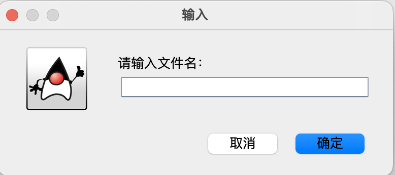
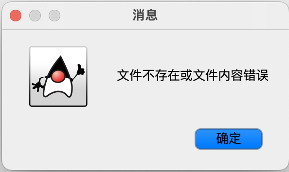
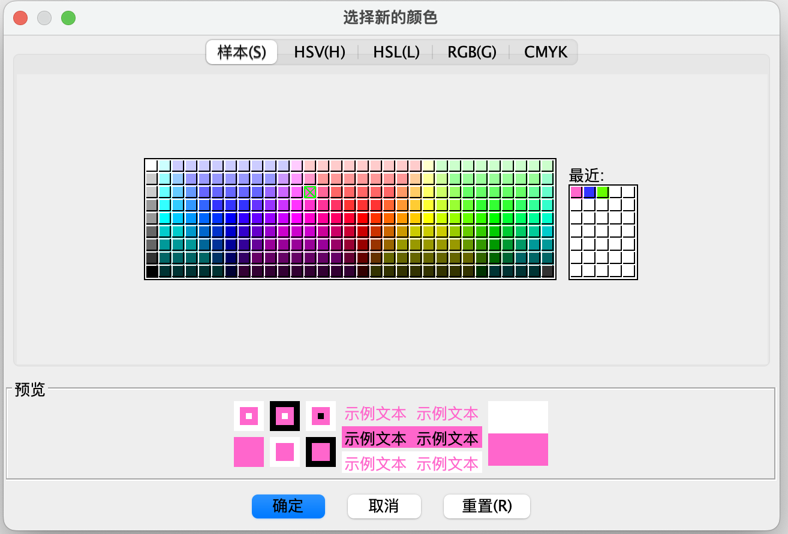

# 刘思锐 3200102708


# 一、实验说明

### 1.1 实验内容

用Java的awt和swing做一个简单的绘图工具，以CAD的方式操作，能放置直线、矩形、圆和文字，能选中图形，修改参数，如颜色等，能拖动图形和调整大小，可以保存和恢复。功能请参考视频演示。

### 1.2 使用说明

本实验基于Java JDK17。终端中使用如下命令运行：

```bash
cd src
javac Main.java										# 编译
jar -cfvm Main.jar MANIFEST.MF .  # 打包为jar并添加MANIFEST
java -jar Main.jar								# 运行jar
```

# 二、程序设计

### 2.1 整体架构设计

本项目文件架构如下：

```
└── src
    ├── Controller.java
    ├── MANIFEST.MF
    ├── Main.java
    ├── MiniCAD.java
    ├── Model.java
    ├── Utils
    │   ├── BaseShape.java
    │   ├── BaseShapeRef.java
    │   ├── FileIO.java
    │   ├── FileOp.java
    │   ├── ShapeType.java
    │   └── ShapeTypeRef.java
    └── View.java
```

项目使用MVC架构进行设计：

- View为显示模块，负责JFrame（窗口）、JPannel（按键组）和Canvas（画布）三个主要组件的行为控制和重绘
- Model为数据模块，负责实现图形增删改的接口与文件读写函数
- Controller为控制模块，实现了所有输入监听函数与输入行为判断

除此之外，其余文件的主要内容如下：

- MANIFEST为打包可直接运行的Jar文件时需要的信息
- Main为程序入口，将创建一个MiniCAD对象
- MiniCAD为程序顶层，分别初始化了MVC三个模块并进行数据绑定
- Utils文件夹内存放工具类
  - BaseShape为所有图形共用的基类，BaseShapeRef是为了传递BaseShape引用而定义的包装类
  - ShapeType为图形种类的枚举，关系到绘图函数的使用，ShapeTypeRef同上
  - FileOp与FileIO为存读取文件函数的接口。为了保证数据沿M->V->C->M单项传递，存读取文件时View没有直接调用Model的函数，而是使用FileIO为Controller对View暴露的接口，FileOp为Model对View暴露的接口。

### 2.2 Model

考虑到增删图形相对低频，项目使用`ArrayList<BaseShape>`结构储存图形；使用`ObjectInputStream`与`ObjectOutputStream`读写文件；`LoadFile`和`SaveFile`为FileIO接口定义的函数。

```Java
public class Model implements FileIO {
    ArrayList<BaseShape> shapes;

    public Model() {
        shapes = new ArrayList<>();
    }

    public void LoadFile(String file_name) throws IOException, ClassNotFoundException {
				// readobject(shapes)
    }

    public void SaveFile(String file_name) throws IOException {
				// writeObject(shapes);
    }
}
```

### 2.3 View

View层负责所有界面元素的外观和行为以及图形的绘制。View中所有按钮只改变Controller模块的状态变量或调用对象提供的函数，这些变量和函数通过MiniCAD顶层中数据绑定获得。View不涉及任何逻辑判断或对Model的直接操作。

```Java
public class View {
    public View() {
        initFrame();
        initTopBar();
        initSelectedBar();
    }

    private void initSelectedBar() {
				// selected_bar位于窗口下方，只有当前已有图形被选中时出现
      	// 包含对单个图形的放大、缩小、加粗、变细、改变颜色、删除
    }

    private void initTopBar() {
    		// top_bar位于窗口上方，用于控制绘图功能，始终出现
    }
  
  	private void initFrame() {
      	// 包括窗口大小、底色、关闭行为等内容的初始化
    }
}

class CadCanvas extends Canvas {
    ArrayList<BaseShape> shapes;
  	// shapes为Model中shapes的引用，在MiniCAD中经数据绑定得到
    @Override
    public void paint(Graphics g) {
				// 遍历绘制shapes中所有图形
    }
}

```

### 2.4 Controller

Controller部分的逻辑核心在于shape_dragged、shape_drawing、shape_selected三者的选择和释放：

- **shape_drawing**：
  - 正在画的图形，画图模式下鼠标按下即创建；鼠标拖动则改变大小；鼠标释放则释放
- **shape_dragged**：
  - 希望拖拽改变位置的图形，非画图模式下鼠标按下即判断当前位置是否有图形；鼠标拖动则改变位置；鼠标释放则释放
- **shape_selected**：
  - 选中的图形，非画图模式下鼠标按下即判断当前位置是否有图形（同shape_dragged）；鼠标点击空白处才会失望

Save与Load为FileIO接口定义的函数，供View调用。

```Java
class Controller implements MouseInputListener, FileOp {
  
  	BaseShape shape_drawing; 	// 正在绘制的图形，用于实现画图时拖拽改变大小
  	BaseShape shape_dragged;	// 正在拖拽的图形，用于实现拖动改变图形位置

    Controller() {
      	// 当前画图模式，通过View的顶栏控制，在MiniCAD中将引用绑定给View
        draw_type          = new ShapeTypeRef();
      	// 当前选中的图形，用于实现View中底栏针对单个选中图形的操作，同样将引用绑定给View
        shape_selected_ref = new BaseShapeRef();
    }

    private void selectShape(int x, int y) {
				// 遍历整个ArrayList<BaseShape> shapes，判断(x, y)是否在某个图形的矩形包围框内
      	// shape_selected_ref = shape_dragged = null或第一个包围(x, y)的图形
    }

    @Override
    public void mousePressed(MouseEvent e) {
				// 如果不处于画图模式，调用selectShape尝试选中某个图形
      	// 反之创建一个新的图形加入shapes数组，并将其赋给shape_drawing
    }

    @Override
    public void mouseReleased(MouseEvent e) {
      	// 如果画出的图形合法，将shape_selected_ref设为刚画出的图形
      	// shape_drawing = null; shape_dragged = null;
    }

    @Override
    public void mouseDragged(MouseEvent e) {
				// 如果shape_drawing != null，改变新绘制的图形的大小
      	// 或者如果shape_dragged ！= null，改变所拖拽图形的位置
    }

    @Override
    public void Save() {
				// 弹窗获取文件名并调用Model的文件接口
    }

    @Override
    public void Load() {
				// 弹窗获取文件名并调用Model的文件接口
    }
}
```

###  2.5 BaseShape

公用图形类，出于本实验功能要求非常简单的原因，图形与文本并未从基类各自衍生而是直接使用了大而全的基类；但这也带来了数据的冗余。

View中底栏对图形的操作是直接调用图形类本身的函数实现的。

```Java
public enum ShapeType {
    LINE, REC, OVAL, TEXT, NaS
    // NaS: Not a Shape，表示非画图模式
}

public class BaseShape implements Serializable {
    public ShapeType type;
    public int       x1, y1, x2, y2;
    public           String text;
    public           Color  color;
    transient public Stroke stroke;									// 根据stroke_width生成的绘图对象
    public           float  stroke_width = 1.5f;		// 线条宽度，仅对图形有效
    public           Font   font;										// 字体，仅对文本有效
    final            double ratio        = 1.1;			// 大小粗细调节的比例系数

    public void ZoomIn()	{...}
    public void ZoomOut()	{...}
    public void Bolder()	{...}
    public void Lighter()	{...}
}
```

# 三、使用说明

用户界面如下，顶栏为功能选项，直线、矩形、椭圆、文字为Toggle，可以记忆按下状态，保持画图模式；底栏为单个图形的控制选项，仅有当前已经选中图形时出现，鼠标点击画布空白位置取消选中即消失。


点击文件存、读取按键后会出现弹窗。



当文件存、读取失败时会有相应的提示。



点击颜色选择将弹出调色板窗口，可任选其中的颜色，下方附有预览窗口供用户参考颜色选择，点击确定即可应用更改。


