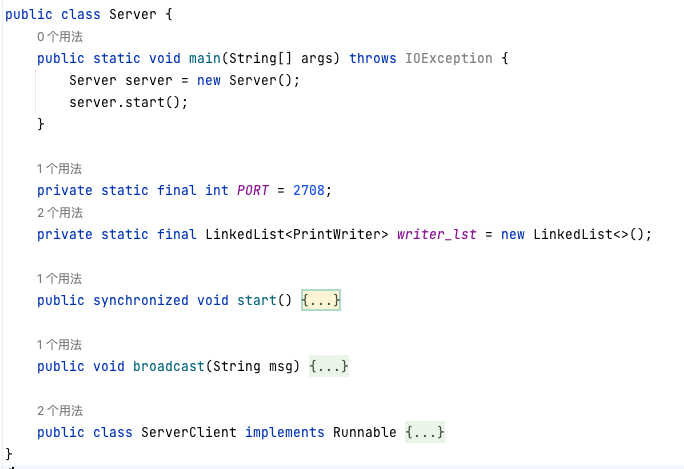
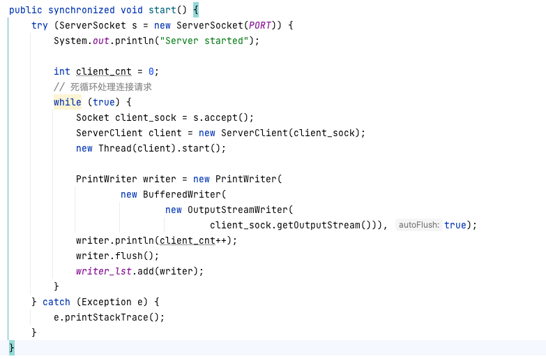
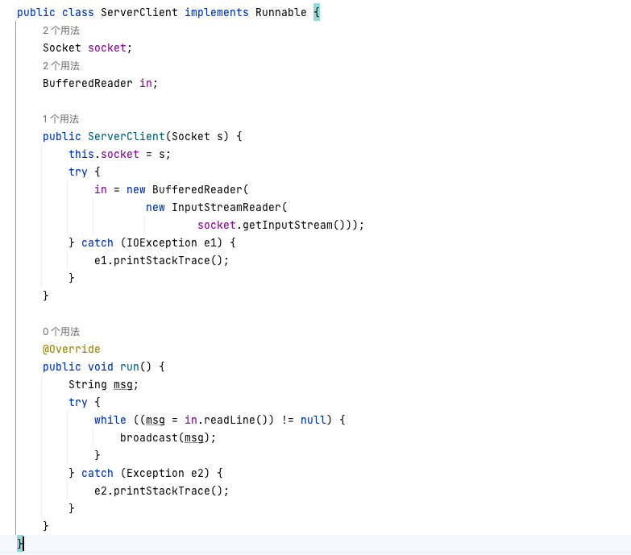
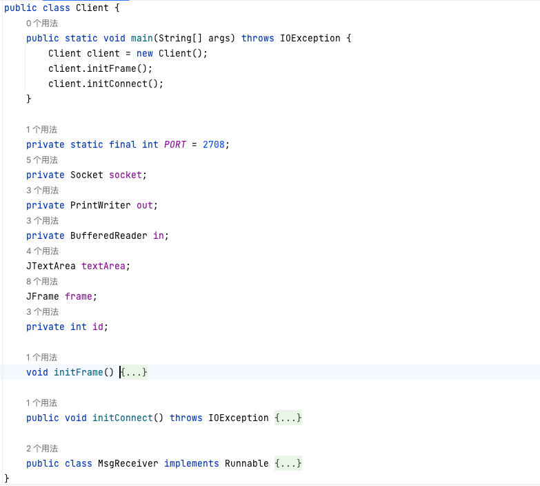
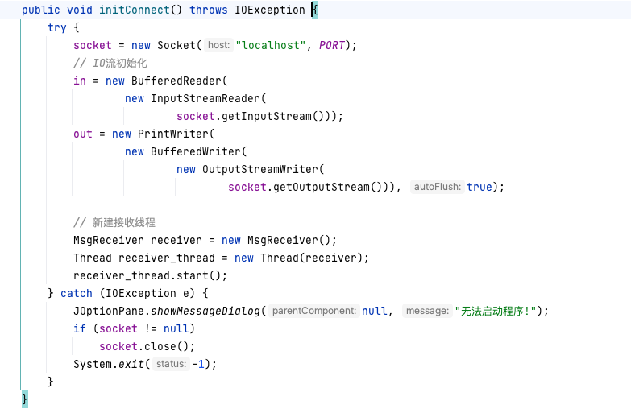
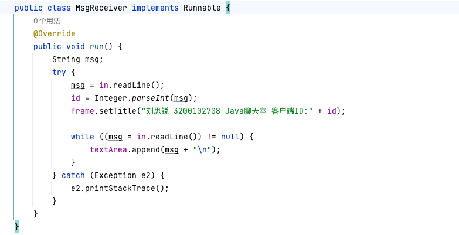
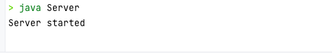
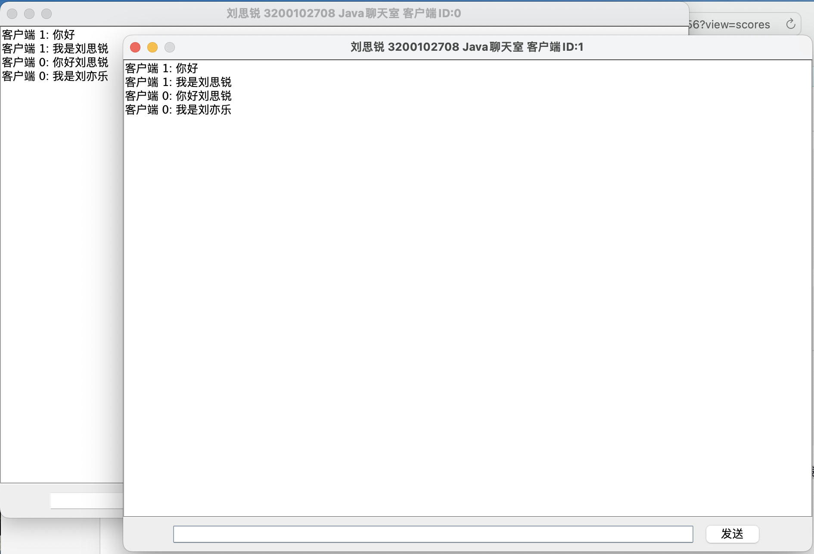

# 刘思锐 3200102708

# 一、实验说明

### 1.1 实验内容

实现一个多客户端的纯文本聊天服务器，能同时接受多个客户端的连接，并将任意一个客户端发送的文本向所有客户端（包括发送方）转发。

### 1.2 使用说明

本实验基于Java JDK19。终端中使用如下命令运行：

```bash
cd {根目录}										
javac Server.java
javac Client.java		# 编译
java Server					# 运行服务端
java Client					# 运行客户端
```

也可以进入out/artifacts文件夹中双击jar文件直接运行。

# 二、程序设计

### 2.1 Server

Server由如下的类实现：



Start()函数用一个死循环持续监听新建链接的请求，连接建立后即新建线程一对一服务客户端，并将对应的输出流加入writer_list。

ServerClient负责接收来自客户端的消息并调用broadCast将其广播给其他所有客户端。



### 2.2 Client

Client由如下的类实现：



为了用户体验，客户端做了最基础的图形界面，由initFrame()函数进行初始化，再在此不做展示。

initConnect()函数根据PORT向本地服务器请求建立连接，建立成功则初始化输入输出的管道。



处于运行效率，MsgReceiver将被一个单独的线程运行，其作用是接收初次连接到服务器时的客户端ID，并持续监听服务器的广播并将消息内容显示到图形界面文本框中。



# 三、使用说明

出于性能考虑，Server关闭了各种提示输出，运行时显示Server started即可。



通过命令行启动Client后界面如下：

- 当前客户端的ID将显示在标题栏
- 上方白框为消息文本显示
- 下方输入框用于发送消息


多个客户端同时使用时效果如下：

